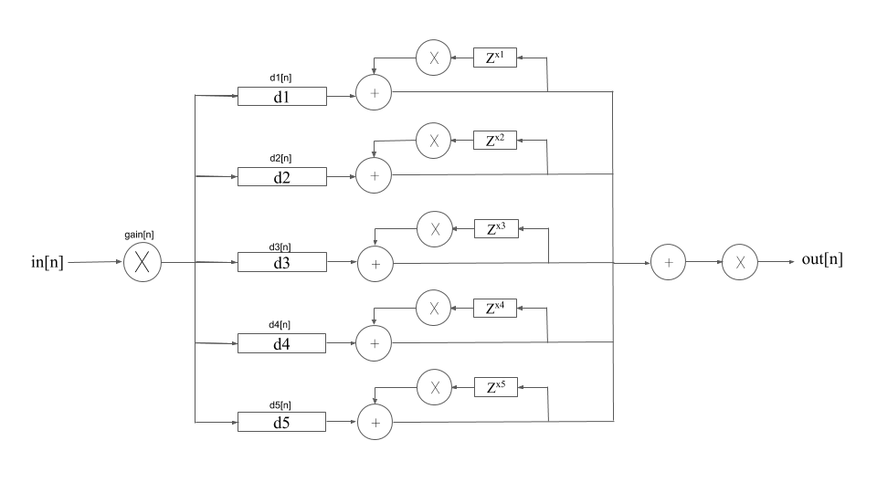

# Shift Drive
This is a saturation .vst plugin with the option to blend together different distortion algorithms and alter the phase
relationship between them. This was my submission for the 2019 AES Student Competition: MATLAB Plugin.

## About
The Shift Drive was designed to be an extremely versatile saturation effect that could be used to slightly bring out 
harmonics in a mastering setting, to add more grit to an already distorted signal, or to completely warp a signal to 
create a completely new sound. With five different clipping algorithms alone, the user can get a multitude of wave shaping
curves. However, with the addition of the phase and feedback sliders, the user can get even more sounds out of the plugin.

## Video Explanation

## Instructions
To use The Shift Drive, simply follow these instructions:
1. Click the "Clone or Download" button
2. Press "Download ZIP"
3. Unzip the folder to view the files
4. Drag "ShiftDrive.vst" into your vst folder (or to where ever 
       your DAW looks for plugins).
    
    
***This is currently only available in .vst so can only be used in 
DAWS that support this format!**
